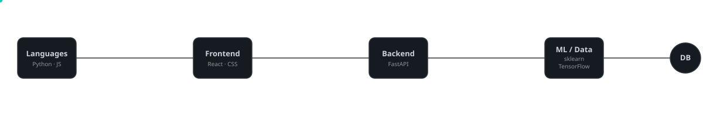
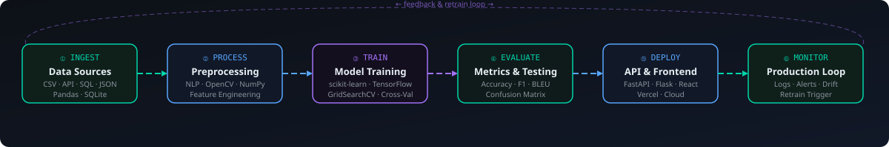

<!-- Animated Banner -->

  

<!-- Social & Portfolio Links -->

&nbsp;

&nbsp;

&nbsp;

  

<!-- Quick Stats Badges -->

&nbsp;

&nbsp;

&nbsp;

 

<!-- Animated Typing Banner -->

  

## 👋 About Me

<table>
  <tr>
    <td width="50%" valign="top">
      <h3>🤖 What I Build</h3>
      NLP pipelines, ML-ranked recommendation systems, and full-stack applications with clean REST APIs. I like to take a problem from raw data all the way to a deployed, user-facing product.
    </td>
    <td width="50%" valign="top">
      <h3>⚡ Current Direction</h3>
      Going deeper on Generative AI and LLMs — building RAG pipelines, prompt engineering workflows, and taking ML projects from Jupyter notebooks to cloud-hosted micro-services.
    </td>
  </tr>
  <tr>
    <td width="50%" valign="top">
      <h3>🛠️ Core Strengths</h3>
      Python (scikit-learn · TensorFlow · OpenCV · Pandas) · FastAPI · Flask · React · SQLite / MySQL / MongoDB · Groq AI
    </td>
    <td width="50%" valign="top">
      <h3>🚀 Looking For</h3>
      Internship or campus placement in <strong>AI/ML Engineering</strong>, Backend Development, or Full-Stack Development. Actively interviewing — DMs open!
    </td>
  </tr>
  <tr>
    <td width="50%" valign="top">
      <h3>🎓 Education</h3>
      B.E. / B.Tech in Computer Science · Tamil Nadu, India Coursework: Machine Learning, Data Structures, DBMS, OS
    </td>
    <td width="50%" valign="top">
      <h3>🏆 Achievements</h3>
      🥈 2nd Place — AI Conclave Hackathon 2024 (₹10,000 prize) 
      📜 Certifications: ML (Coursera) · Python (HackerRank)
    </td>
  </tr>
</table>

## 🚀 Tech Stack in Motion

  
    

  <!-- Skill Icons Grid -->
   
  

 

<strong>📊 Skill Proficiency Breakdown</strong>

 

| Domain | Technologies | Level |
|--------|-------------|-------|
| **ML / AI** | scikit-learn, TensorFlow, OpenCV, NLP, Groq AI | ████████░░ 80% |
| **Backend** | Python, FastAPI, Flask, REST APIs | █████████░ 90% |
| **Frontend** | React, HTML, CSS, JavaScript | ███████░░░ 70% |
| **Databases** | SQLite, MySQL, MongoDB | ████████░░ 80% |
| **DevOps/Tools** | Git, GitHub Actions, Vercel, VS Code | ████████░░ 75% |
| **Gen AI / LLM** | Prompt Engineering, RAG, Groq API | ██████░░░░ 60% |

## 🧠 AI/ML Production Pipeline

  

> Every project I build follows this pattern: clean ingestion → robust preprocessing → validated model → measurable metrics → deployed API → monitored in production.

## 📌 Featured Projects

<!-- Pinned repo cards — update slugs to exact repo names -->

 

<strong>🗺️ Full Project Map</strong>

 

<table>
  <tr>
    <th align="left">Project</th>
    <th align="left">What it solves</th>
    <th align="left">Stack</th>
    <th align="left">Status</th>
  </tr>

  <!-- AI/ML -->
  <tr>
    <td colspan="4" bgcolor="#161b22"><strong>🤖 AI &amp; Machine Learning Systems</strong></td>
  </tr>
  <tr>
    <td><a href="https://github.com/nivash467/ai-resume-screening-system"><strong>AI Resume Screening System</strong></a></td>
    <td>NLP-powered ATS: extracts skills, ranks candidates, removes recruiter bias from shortlisting</td>
    <td><code>Python</code> <code>NLP</code> <code>FastAPI</code> <code>scikit-learn</code> <code>SQLite</code></td>
    <td>✅ Completed</td>
  </tr>
  <tr>
    <td><a href="https://github.com/nivash467/farm2bag"><strong>Farm2Bag — Healthcare E-Commerce + AI</strong></a></td>
    <td>Full-stack healthcare storefront with AI chatbot for medical Q&amp;A and ML product recommendations</td>
    <td><code>Python</code> <code>scikit-learn</code> <code>NumPy</code> <code>JavaScript</code></td>
    <td>✅ Completed</td>
  </tr>

  <!-- Full Stack -->
  <tr>
    <td colspan="4" bgcolor="#161b22"><strong>💻 Full-Stack &amp; Desktop Applications</strong></td>
  </tr>
  <tr>
    <td><a href="https://github.com/nivash467/student-registration-management-system"><strong>Student Registration &amp; Management System</strong></a></td>
    <td>Desktop academic admin app: registration, full CRUD, automated SMTP email alerts</td>
    <td><code>Python</code> <code>Tkinter</code> <code>SQLite</code> <code>SMTP</code></td>
    <td>✅ Completed</td>
  </tr>

  <!-- In Progress -->
  <tr>
    <td colspan="4" bgcolor="#161b22"><strong>🔬 Active Exploration</strong></td>
  </tr>
  <tr>
    <td><strong>RAG-powered Knowledge Bot</strong></td>
    <td>Retrieval-Augmented Generation chatbot using local documents + Groq API for fast inference</td>
    <td><code>Python</code> <code>Groq AI</code> <code>LangChain</code> <code>FastAPI</code></td>
    <td>🚧 In Progress</td>
  </tr>
</table>

## 📊 Live GitHub Signal

<!-- Stats + Top Languages side by side -->

 

<!-- Streak -->

 

<!-- Trophies -->

 

<!-- Activity Graph -->

## 🐍 Contribution Snake

<!-- Snake generated by .github/workflows/snake.yml → pushed to "output" branch -->
<picture>
  <source media="(prefers-color-scheme: dark)"  srcset="https://raw.githubusercontent.com/nivash467/nivash467/output/github-contribution-grid-snake-dark.svg"/>
  <source media="(prefers-color-scheme: light)" srcset="https://raw.githubusercontent.com/nivash467/nivash467/output/github-contribution-grid-snake.svg"/>
  
</picture>

## 📬 Let's Connect

I'm always open to collaborating on AI/ML projects, contributing to open-source, or just talking tech.

 

| Platform | Link |
|----------|------|
| 💼 LinkedIn | [linkedin.com/in/nivashml](https://www.linkedin.com/in/nivashml) |
| 🌐 Portfolio | [nivash-portfolio-one.vercel.app](https://nivash-portfolio-one.vercel.app/) |
| 📧 Email | nivash467@gmail.com |
| 🐙 GitHub | [@nivash467](https://github.com/nivash467) |

 

---

  ⭐ If you found my projects useful, consider starring the repo — it means a lot!

